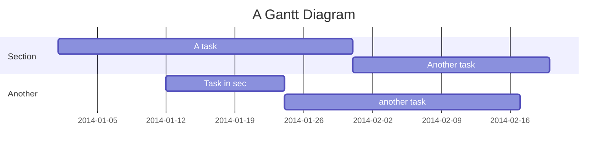

## Excerice pour le 26 janvier 2022

>  exercice : afficher dans une page markdown d'un répertoire github, la requête SPARQL ainsi que le résultat de la requête sous forme d'une carte 
>  la requête : toutes les sculptures de Rodin conservé dans un musée américain



#### Requête 1

````sparql
#defaultView:Map
SELECT ?item ?itemLabel ?lieuconservation ?lieuconservationLabel ?lieuconservationCoord ?datecreation
WHERE
{
  ?item wdt:P31 wd:Q860861 .
  ?item wdt:P170 wd:Q30755 .
  ?item wdt:P571 ?datecreation.

   ?item wdt:P276 ?lieuconservation .
   ?lieuconservation wdt:P17 wd:Q30. 
    ?lieuconservation wdt:P625 ?lieuconservationCoord.

    SERVICE wikibase:label { bd:serviceParam wikibase:language "[AUTO_LANGUAGE],en". }

  }
````

#### Requête 2

````sparql
#defaultView:Map
SELECT ?item ?itemLabel ?lieuconservation ?lieuconservationLabel ?lieuconservationCoord ?datecreation
WHERE
{
  ?item wdt:P31 wd:Q860861 .
  ?item wdt:P170 wd:Q30755 .
  ?item wdt:P571 ?datecreation.
   FILTER (?datecreation <= "1900"^^xsd:dateTime)

   ?item wdt:P276 ?lieuconservation .
   ?lieuconservation wdt:P17 wd:Q30. 
    ?lieuconservation wdt:P625 ?lieuconservationCoord.

    SERVICE wikibase:label { bd:serviceParam wikibase:language "[AUTO_LANGUAGE],en". }

  }

````

#### Requête 3
````sparql
#defaultView:Map
SELECT ?item ?itemLabel ?lieuconservation ?lieuconservationLabel ?lieuconservationCoord ?datecreation
WHERE
{
  ?item wdt:P31 wd:Q860861 .
  ?item wdt:P170 wd:Q30755 .
  ?item wdt:P571 ?datecreation.
   FILTER (?datecreation <= "1900"^^xsd:dateTime)

   ?item wdt:P276 ?lieuconservation .
    { ?lieuconservation wdt:P17 wd:Q30. } UNION { ?lieuconservation wdt:P17 wd:Q142. }
    ?lieuconservation wdt:P625 ?lieuconservationCoord.

    SERVICE wikibase:label { bd:serviceParam wikibase:language "[AUTO_LANGUAGE],en". }

  }

````

#### Requête 4
````sparql
#defaultView:Map{"layer": "?materiauxLabel"}
SELECT ?item ?itemLabel ?lieuconservation ?lieuconservationLabel ?lieuconservationCoord ?datecreation ?materiauxLabel
WHERE
{
  ?item wdt:P31 wd:Q860861 .
  ?item wdt:P170 wd:Q30755 .
  ?item wdt:P571 ?datecreation.
  ?item wdt:P186 ?materiaux. 
   FILTER (?datecreation <= "1900"^^xsd:dateTime)

   ?item wdt:P276 ?lieuconservation .
    { ?lieuconservation wdt:P17 wd:Q30. } UNION { ?lieuconservation wdt:P17 wd:Q142. }
    ?lieuconservation wdt:P625 ?lieuconservationCoord.

    SERVICE wikibase:label { bd:serviceParam wikibase:language "fr". }

  }

````

Requête 5

````sparql
SELECT ?item ?itemLabel ?createurLabel WHERE {
  ?item wdt:P31/wdt:P279* wd:Q3305213.
  ?item wdt:P276 wd:Q23402.
  ?item wdt:P170 ?createur.
  FILTER NOT EXISTS {?createur wdt:P27 wd:Q142. }

    SERVICE wikibase:label { bd:serviceParam wikibase:language "[AUTO_LANGUAGE],en". }
}
````

